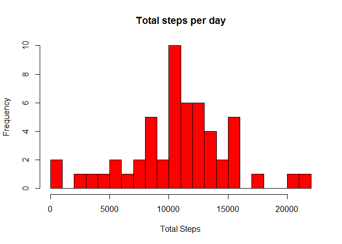
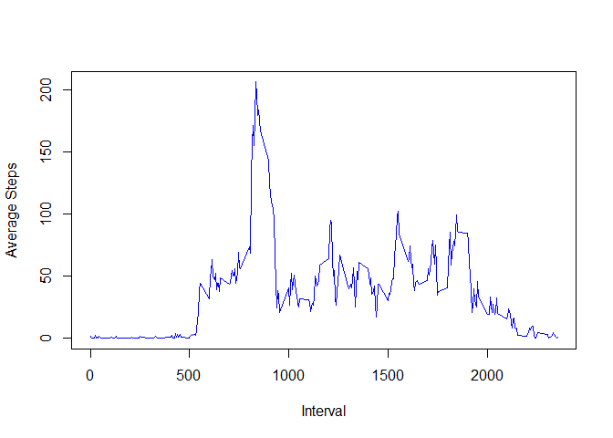
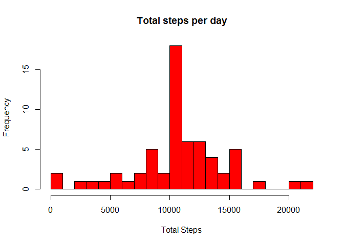
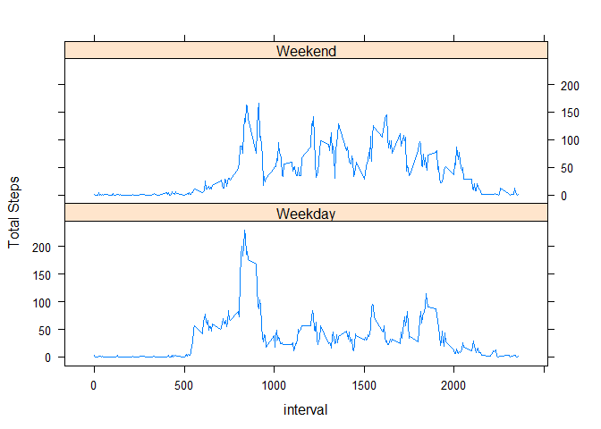

# "RepData_PeerAssessment1"
###1)What is mean total number of steps taken per day?

Solution:Read file,group by date and calculate total steps per day


```r
library(plyr)
adata<-read.csv("activity.csv",header=TRUE,sep=",")
walk_data<-ddply(adata,.(date),summarize,steps=sum(steps))
hist(walk_data$steps,breaks=20,col="red",
     main="Total steps per day",xlab ="Total Steps")
```

 

####Mean and Median of total steps
Note:NA values are removed from the walk_data df as Mean and Median become NA if NA values are included

```r
mean(walk_data$steps,na.rm=TRUE)
```

```
## [1] 10766.19
```

```r
median(walk_data$steps,na.rm=TRUE)
```

```
## [1] 10765
```

###2) What is the average daily activity pattern?
Solution:Remove NA values from activity data
Group data by interval and calculate average steps per interval

```r
library(ggplot2)
cdata<-adata[complete.cases(adata),]
interval_data<-ddply(cdata,.(interval),summarize,steps=mean(steps))
plot(interval_data$interval, interval_data$steps, type="l", xlab="Interval",ylab="Average Steps",col="blue")
```

 
#####Interval with max average steps

```r
subset(interval_data,steps==max(interval_data$steps))[1]
```

```
##     interval
## 104      835
```

###3)Imputing missing values
####Total missing values

```r
mdata<-adata[!complete.cases(adata),]
nrow(mdata)
```

```
## [1] 2304
```
####Fill missing values
Solution:Add average step value per interval to "NA" values of the corresponding interval. Merge mdata df and interval_Data df from above. Rbind df without missing values and updated missing values df. Calculate total steps taken per day and mean/median of total steps per day


```r
missing_values<-merge(mdata,interval_data,by.x="interval",by.y="interval",all=FALSE)
missing_values$steps.x<-NULL
names(missing_values)[3]<-paste("steps")
missing_values_mod<-missing_values[c(3,2,1)]

complete_data<-rbind(cdata,missing_values_mod)
complete_data_sort <- complete_data[order(complete_data$date,complete_data$interval),]


walk_data_mod<-ddply(complete_data_sort,.(date),summarize,steps=sum(steps))
hist(walk_data_mod$steps,breaks=20,col="red",
     main="Total steps per day",xlab ="Total Steps")
```

 

```r
mean(walk_data_mod$steps)
```

```
## [1] 10766.19
```

```r
median(walk_data_mod$steps)
```

```
## [1] 10766.19
```
####4)Differences in activity patterns between weekdays and weekends?


```r
complete_data_sort$week=ifelse(weekdays(as.Date(complete_data_sort$date)) %in% c("Monday","Tuesday","Wednesday","Thursday","Friday"),"Weekday","Weekend")
complete_data_mod<-ddply(complete_data_sort,.(week,interval),summarize,steps=mean(steps))
library(lattice)
xyplot(steps~interval|week,type="l",ylab="Total Steps",data=complete_data_mod,layout=c(1,2))
```

 
